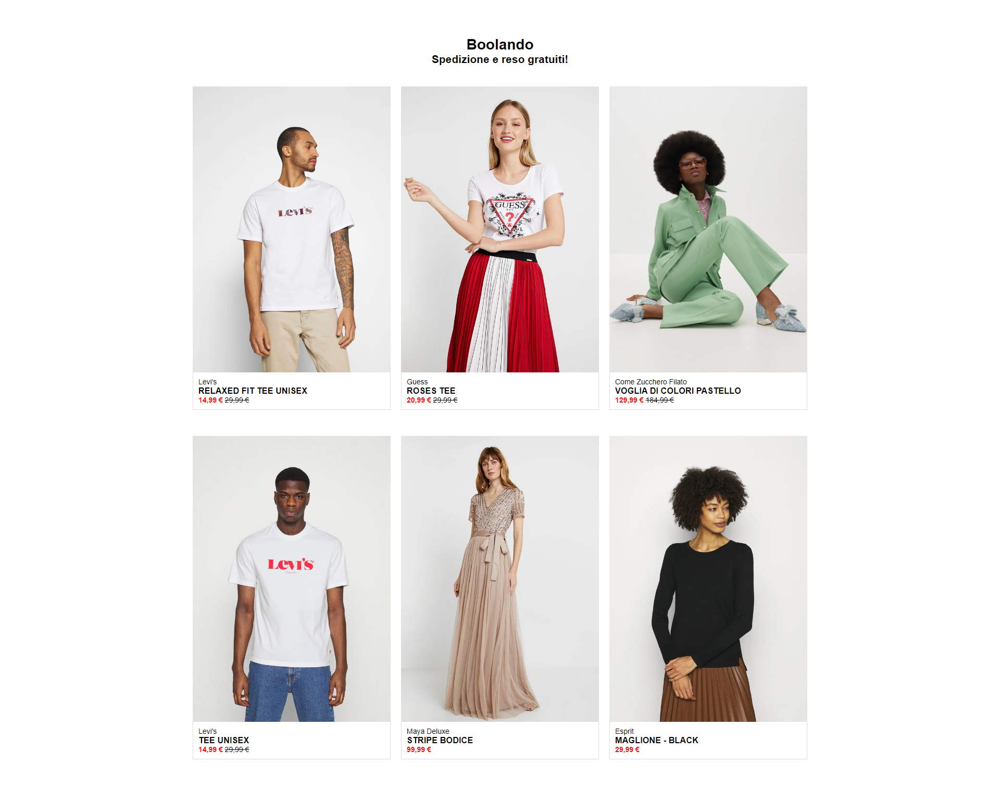
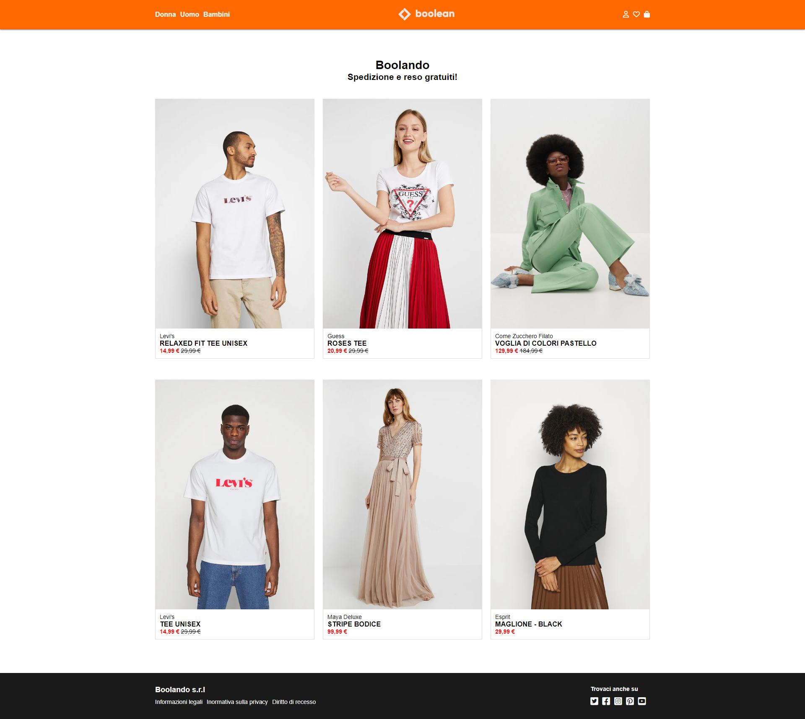
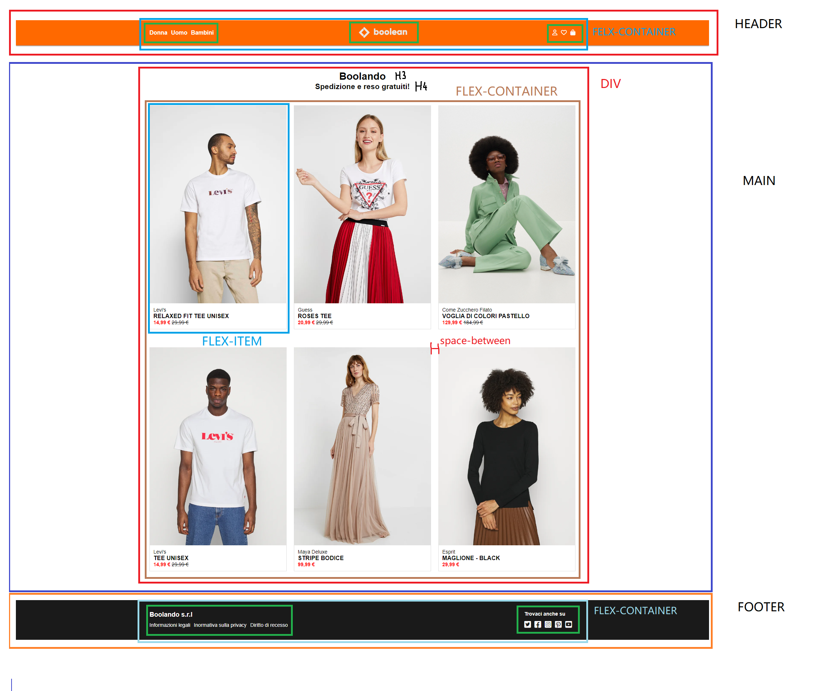

# html-css-boolando

- [html-css-boolando](#html-css-boolando)
- [Boolando](#boolando)
  - [Esercizio](#esercizio)
    - [Consegna](#consegna)
      - [Consegna base](#consegna-base)
      - [Consegna bonus](#consegna-bonus)
  - [Svolgimento](#svolgimento)
    - [Analisi grafica](#analisi-grafica)
    - [Risultato-base](#risultato-base)
    - [Risultato-bonus](#risultato-bonus)

# Boolando

## Esercizio

### Consegna

Imitare una versione semplificata di una pagina di Zalando.
Ci ispiriamo al sito di Zalando per riprodurre il layout nello screenshot. Analizzate prima il layout solo con i commenti, poi passate ai blocchi colorati. Solo se i blocchi colorati funzionano passiamo al particolare...

#### Consegna base

#### Consegna bonus

## Svolgimento

### Analisi grafica

### Risultato-base

<!--  -->

### Risultato-bonus

<!--  -->
