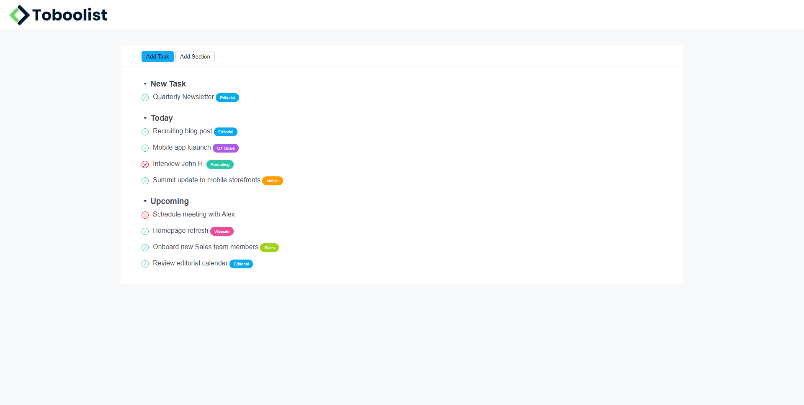

- [Toboolist](#toboolist)
  - [Esercizio](#esercizio)
    - [Consegna](#consegna)
    - [Consigli](#consigli)
  - [Svolgimento](#svolgimento)
    - [Analisi grafica](#analisi-grafica)
    - [Risultato](#risultato)

# Toboolist

## Esercizio

### Consegna

Ricreiamo una TodoList basandosi sul seguente layout:

### Consigli

Partiamo sempre dal definire le macroaree del layout e analizziamo poi gli elementi in comune nelle diverse aree e quindi tutto ciò che possiamo centralizzare, per rendere il codice meno ripetitivo e quindi più mantenibile.

## Svolgimento

### Analisi grafica

### Risultato

